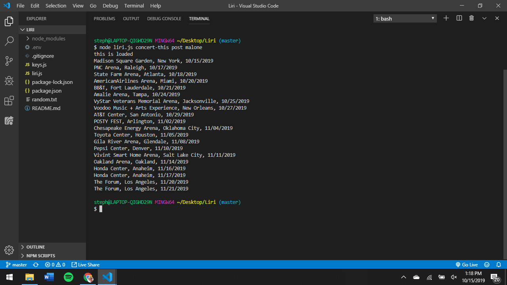

[![Contributors][contributors-shield]][contributors-url]
[![Forks][forks-shield]][forks-url]
[![Stargazers][stars-shield]][stars-url]
[![Issues][issues-shield]][issues-url]
[![LinkedIn][linkedin-shield]][linkedin-url]


<!-- PROJECT LOGO -->
<br />
<p align="center">
  <a href="https://github.com/StephenTHendrix/liri">
    
  </a>

  <h3 align="center">Liri (CLI)</h3>

  <p align="center">
    Like Siri, for specific uses.
    <br />
    <a href="https://github.com/StephenTHendrix/liri"><strong>Explore the docs »</strong></a>
    <br />
    <br />
    <a href="https://github.com//repo/issues">Report Bug</a>
    ·
    <a href="https://github.com/github_username/repo/issues">Request Feature</a>
  </p>
</p>


<!-- TABLE OF CONTENTS -->
## Table of Contents

* [About the Project](#about-the-project)
* [Getting Started](#getting-started)
  * [Prerequisites](#prerequisites)
  * [Installation](#installation)
* [Usage](#usage)
* [Roadmap](#roadmap)
* [Contact](#contact)


<!-- ABOUT THE PROJECT -->
## About The Project

[![Concert Screen Shot][concert-screenshot]]
[![Movie Name Screen Shot][movie-screenshot]]
[![Movie Name Default Screen Shot][nobody-screenshot]]
[![Spotify Name Screen Shot][spotify-screenshot]]
[![Random Name Screen Shot][random-screenshot]]


<!-- GETTING STARTED -->
## Getting Started

To get a local copy up and running follow these simple steps.

### Prerequisites

This is an example of how to list things you need to use the software and how to install them.
* npm
```sh
npm install --save node-spotify-api
```
npm install axios
```
npm i moment
```
npm i dotenv
```

### Installation
 
1. Clone the repo
```sh
git clone https:://github.com/StephenTHendrix/Liri.git
```
2. Install NPM packages
```sh
npm install
```
3. Navigate to the root of your project and run `npm init -y` &mdash; this will initialize a `package.json` file for your project. The `package.json` file is required for installing third party npm packages and saving their version numbers. If you fail to initialize a `package.json` file, it will be troublesome, and at times almost impossible for anyone else to run your code after cloning your project.

4. Make a `.gitignore` file and add the following lines to it. This will tell git not to track these files, and thus they won't be committed to Github.

```
node_modules
.DS_Store
.env
```

5. Make a JavaScript file named `keys.js`.

* Inside keys.js your file will look like this:

```js
console.log('this is loaded');

exports.spotify = {
  id: process.env.SPOTIFY_ID,
  secret: process.env.SPOTIFY_SECRET
};
```

6. Next, create a file named `.env`, add the following to it, replacing the values with your API keys (no quotes) once you have them:

```js
# Spotify API keys

SPOTIFY_ID=your-spotify-id
SPOTIFY_SECRET=your-spotify-secret

```

* This file will be used by the `dotenv` package to set what are known as environment variables to the global `process.env` object in node. These are values that are meant to be specific to the computer that node is running on, and since we are gitignoring this file, they won't be pushed to github &mdash; keeping our API key information private.

* If someone wanted to clone your app from github and run it themselves, they would need to supply their own `.env` file for it to work.

7. Make a file called `random.txt`.

   * Inside of `random.txt` put the following in with no extra characters or white space:

     * spotify-this-song,"I Want it That Way"

8. Make a JavaScript file named `liri.js`.

9. At the top of the `liri.js` file, add code to read and set any environment variables with the dotenv package:

```js
require("dotenv").config();
```

10. Add the code required to import the `keys.js` file and store it in a variable.

```js
  var keys = require("./keys.js");
```
  
* You should then be able to access your keys information like so

  ```js
  var spotify = new Spotify(keys.spotify);
  ```

11. Make it so liri.js can take in one of the following commands:

   * `concert-this`

   * `spotify-this-song`

   * `movie-this`

   * `do-what-it-says`


<!-- USAGE EXAMPLES -->
## Usage

### What Each Command Should Do

1. `node liri.js concert-this <artist/band name here>`

   * This will search the Bands in Town Artist Events API (`"https://rest.bandsintown.com/artists/" + artist + "/events?app_id=codingbootcamp"`) for an artist and render the following information about each event to the terminal:

     * Name of the venue

     * Venue location

     * Date of the Event (use moment to format this as "MM/DD/YYYY")

    * **Important**: There is no need to sign up for a Bands in Town `api_id` key. Use the `codingbootcamp` as your `app_id`. For example, the URL used to search for "Celine Dion" would look like the following:

      * `https://rest.bandsintown.com/artists/celine+dion/events?app_id=codingbootcamp`

2. `node liri.js spotify-this-song '<song name here>'`

   * This will show the following information about the song in your terminal/bash window

     * Artist(s)

     * The song's name

     * A preview link of the song from Spotify

     * The album that the song is from

   * If no song is provided then your program will default to "The Sign" by Ace of Base.

   * You will utilize the [node-spotify-api](https://www.npmjs.com/package/node-spotify-api) package in order to retrieve song information from the Spotify API.

   * The Spotify API requires you sign up as a developer to generate the necessary credentials. You can follow these steps in order to generate a **client id** and **client secret**:

   * Step One: Visit <https://developer.spotify.com/my-applications/#!/>

   * Step Two: Either login to your existing Spotify account or create a new one (a free account is fine) and log in.

   * Step Three: Once logged in, navigate to <https://developer.spotify.com/my-applications/#!/applications/create> to register a new application to be used with the Spotify API. You can fill in whatever you'd like for these fields. When finished, click the "complete" button.

   * Step Four: On the next screen, scroll down to where you see your client id and client secret. Copy these values down somewhere, you'll need them to use the Spotify API and the [node-spotify-api package](https://www.npmjs.com/package/node-spotify-api).

3. `node liri.js movie-this '<movie name here>'`

   * This will output the following information to your terminal/bash window:

     ```
       * Title of the movie.
       * Year the movie came out.
       * IMDB Rating of the movie.
       * Rotten Tomatoes Rating of the movie.
       * Country where the movie was produced.
       * Language of the movie.
       * Plot of the movie.
       * Actors in the movie.
     ```

   * If the user doesn't type a movie in, the program will output data for the movie 'Mr. Nobody.'

     * If you haven't watched "Mr. Nobody," then you should: <http://www.imdb.com/title/tt0485947/>

     * It's on Netflix!

   * You'll use the `axios` package to retrieve data from the OMDB API. Like all of the in-class activities, the OMDB API requires an API key. You may use `trilogy`.

4. `node liri.js do-what-it-says`

   * Using the `fs` Node package, LIRI will take the text inside of random.txt and then use it to call one of LIRI's commands.

     * It should run `spotify-this-song` for "I Want it That Way," as follows the text in `random.txt`.

     * Edit the text in random.txt to test out the feature for movie-this and concert-this.


<!-- ROADMAP -->
## Roadmap

See the [open issues](https://github.com/StephenTHendrix//issues) for a list of proposed features (and known issues).


<!-- CONTRIBUTING -->
## Contributing

Contributions are what make the open source community such an amazing place to be learn, inspire, and create. Any contributions you make are **greatly appreciated**.

1. Fork the Project
2. Create your Feature Branch (`git checkout -b feature/AmazingFeature`)
3. Commit your Changes (`git commit -m 'Add some AmazingFeature'`)
4. Push to the Branch (`git push origin feature/AmazingFeature`)
5. Open a Pull Request


<!-- CONTACT -->
## Contact

Stephen Hendrix - StephenTHendrix@gmail.com

Project Link: [https://github.com/StephenTHendrix/liri](https://github.com/StephenTHendrix/liri)


<!-- MARKDOWN LINKS & IMAGES -->
<!-- https://www.markdownguide.org/basic-syntax/#reference-style-links -->
[contributors-shield]: https://img.shields.io/github/contributors/StephenTHendrix/liri.svg?style=flat-square
[contributors-url]: https://github.com/StephenTHendrix/liri/graphs/contributors
[forks-shield]: https://img.shields.io/github/forks/StephenTHendrix/liri.svg?style=flat-square
[forks-url]: https://github.com/StephenTHendrix/liri/network/members
[stars-shield]: https://img.shields.io/github/stars/StephenTHendrix/liri.svg?style=flat-square
[stars-url]: https://github.com/StephenTHendrix/liri/stargazers
[issues-shield]: https://img.shields.io/github/issues/StephenTHendrix/liri.svg?style=flat-square
[issues-url]: https://github.com/StephenTHendrix/liri/issues
[license-shield]: https://img.shields.io/github/license/StephenTHendrix/liri.svg?style=flat-square
[license-url]: https://github.com/StephenTHendrix/liri/blob/master/LICENSE.txt
[linkedin-shield]: https://img.shields.io/badge/-LinkedIn-black.svg?style=flat-square&logo=linkedin&colorB=555
[linkedin-url]: https://linkedin.com/in/StephenTHendrix
[product-screenshot]: images/screenshot.png

[concert-screenshot]: images/concert.png
[movie-screenshot]: images/movie.png
[nobody-screenshot]: images/nobody.png
[spotify-screenshot]: images/spotify.png
[random-screenshot]: images/random.png
